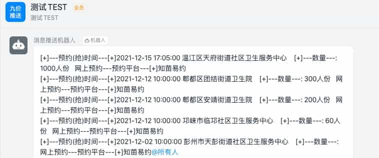
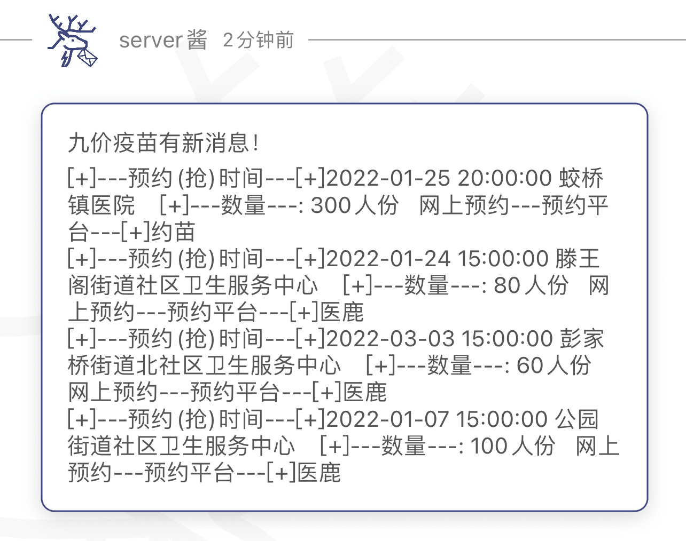
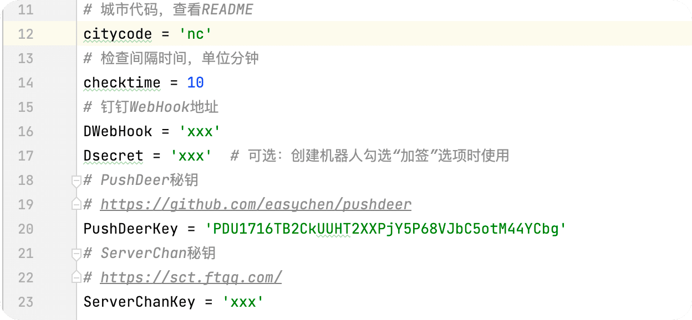

# HPVchecker, 九价疫苗消息推送器

## 九价疫苗信息推送(仅限学习研究使用)

只为给女朋友抢一针疫苗，舔狗进度25%

原项目为[cnhouzi/9jiainfo](cnhouzi/9jiainfo)，本项目对原脚本进行优化和功能拓展以实现Server酱、pushDeer通知，同时完善README文件

此项目仅提供相关消息推送，请配合其他抢苗脚本实现舔狗进度100%

## 程序运行效果

### 钉钉：



### Dushdeer推送：



## 配置

- 需要安装依赖库:

```
pip3 install -r requirements.txt
```



- 配置第11-12行的城市代码，一般为城市缩写，比如：南昌-nc 北京-bj 。部分城市缩写重复，请查看末尾代码名单
- 配置第13-14行的扫描间隔时间
- 对于钉钉推送（使用钉钉的人推荐），配置第15-17行的代码
- 对于PushDeer推送（强烈推荐。全平台免费推送），修改18-20行的代码
- 对于Server酱、ServerChan推送（不推荐，发送的消息没法换行不美观），修改21-23行的代码


## 运行

`python3 HPVchecker.py`

或者挂在vps、服务器上（推荐）

`nohup python3 HPVchecker.py`

## 更新

切换到项目文件夹的目录下，执行:

```
git pull
```

## 更新日志

- V0.0.1 demo version，开源GitHub
- V0.0.2 修改信息源，即更新请求的URL
- V0.0.3 
  - 增加内容更新判断
  - 增加地区选择
- V0.0.4
    - 增加休息功能
    - 简化内容
- V0.0.5
    - 加入常用的server酱和最近流行的PushDeer推送
    - 优化重复运行逻辑
    - 首次运行发送疫苗情况
    - 免责声明，手动狗头
    - 优化README
    
## 问题

- 欢迎提交issues，贴上完整的报错以及截图

## Todo

- [x] 内容更新判断
- [x] 地区选择
- [x] 增加休息功能，22点到8点不推送 
- [x] 简化内容(格式化获取到的内容)
- [x] 加入常用的server酱和最近流行的PushDeer推送
- [x] 优化重复运行逻辑
- [x] 首次运行发送疫苗情况
- [ ] 优化curl命令为python代码
- [ ] 支持使用GitHubAction、云函数，摆脱服务器运行

## 附录：城市代码

-  省份: 重庆
  下属城市:
    - 城市名称: 重庆
      城市代号: cq
      所属省份: 重庆
-  省份: 吉林
  下属城市:
    - 城市名称: 长春
      城市代号: cc
      所属省份: 吉林
-  省份: 甘肃
  下属城市:
    - 城市名称: 兰州
      城市代号: lz
      所属省份: 甘肃
-  省份: 安徽
  下属城市:
    - 城市名称: 合肥
      城市代号: hf
      所属省份: 安徽
    - 城市名称: 芜湖
      城市代号: wuhu
      所属省份: 安徽
-  省份: 新疆
  下属城市:
    - 城市名称: 乌鲁木齐
      城市代号: wlmq
      所属省份: 新疆
-  省份: 上海
  下属城市:
    - 城市名称: 上海
      城市代号: sh
      所属省份: 上海
-  省份: 内蒙古
  下属城市:
    - 城市名称: 呼和浩特
      城市代号: hu
      所属省份: 内蒙古
-  省份: 湖南
  下属城市:
    - 城市名称: 长沙
      城市代号: cs
      所属省份: 湖南
    - 城市名称: 岳阳
      城市代号: yy
      所属省份: 湖南
    - 城市名称: 湘潭
      城市代号: xiangtan
      所属省份: 湖南
    - 城市名称: 邵阳
      城市代号: shaoyang
      所属省份: 湖南
    - 城市名称: 郴州
      城市代号: chenzhou
      所属省份: 湖南
    - 城市名称: 衡阳
      城市代号: hy
      所属省份: 湖南
-  省份: 云南
  下属城市:
    - 城市名称: 昆明
      城市代号: km
      所属省份: 云南
-  省份: 广东
  下属城市:
    - 城市名称: 广州
      城市代号: gz
      所属省份: 广东
    - 城市名称: 梅州
      城市代号: mz
      所属省份: 广东
    - 城市名称: 东莞
      城市代号: dg
      所属省份: 广东
    - 城市名称: 江门
      城市代号: jm
      所属省份: 广东
    - 城市名称: 韶关
      城市代号: sg
      所属省份: 广东
    - 城市名称: 汕尾
      城市代号: sw
      所属省份: 广东
    - 城市名称: 深圳
      城市代号: sz
      所属省份: 广东
    - 城市名称: 阳江
      城市代号: yj
      所属省份: 广东
    - 城市名称: 佛山
      城市代号: fs
      所属省份: 广东
    - 城市名称: 肇庆
      城市代号: zq
      所属省份: 广东
    - 城市名称: 揭阳
      城市代号: jy
      所属省份: 广东
    - 城市名称: 中山
      城市代号: zs
      所属省份: 广东
    - 城市名称: 汕头
      城市代号: st
      所属省份: 广东
    - 城市名称: 茂名
      城市代号: mm
      所属省份: 广东
    - 城市名称: 湛江
      城市代号: zhanjiang
      所属省份: 广东
    - 城市名称: 珠海
      城市代号: zh
      所属省份: 广东
    - 城市名称: 惠州
      城市代号: huizhou
      所属省份: 广东
-  省份: 江西
  下属城市:
    - 城市名称: 南昌
      城市代号: nc
      所属省份: 江西
    - 城市名称: 九江
      城市代号: jj
      所属省份: 江西
-  省份: 宁夏
  下属城市:
    - 城市名称: 银川
      城市代号: yc
      所属省份: 宁夏
-  省份: 青海
  下属城市:
    - 城市名称: 西宁
      城市代号: xn
      所属省份: 青海
-  省份: 天津
  下属城市:
    - 城市名称: 天津
      城市代号: tj
      所属省份: 天津
-  省份: 北京
  下属城市:
    - 城市名称: 北京
      城市代号: bj
      所属省份: 北京
-  省份: 贵州
  下属城市:
    - 城市名称: 贵阳
      城市代号: gy
      所属省份: 贵州
-  省份: 江苏
  下属城市:
    - 城市名称: 南京
      城市代号: nj
      所属省份: 江苏
    - 城市名称: 镇江
      城市代号: zj
      所属省份: 江苏
    - 城市名称: 淮安
      城市代号: ha
      所属省份: 江苏
    - 城市名称: 苏州
      城市代号: suzhou
      所属省份: 江苏
    - 城市名称: 盐城
      城市代号: yancheng
      所属省份: 江苏
    - 城市名称: 常州
      城市代号: cz
      所属省份: 江苏
    - 城市名称: 无锡
      城市代号: wx
      所属省份: 江苏
    - 城市名称: 泰州
      城市代号: taizhou
      所属省份: 江苏
    - 城市名称: 连云港
      城市代号: lyg
      所属省份: 江苏
    - 城市名称: 南通
      城市代号: nt
      所属省份: 江苏
    - 城市名称: 扬州
      城市代号: yz
      所属省份: 江苏
-  省份: 陕西
  下属城市:
    - 城市名称: 西安
      城市代号: xa
      所属省份: 陕西
-  省份: 四川
  下属城市:
    - 城市名称: 成都
      城市代号: cd
      所属省份: 四川
    - 城市名称: 达州
      城市代号: dazhou
      所属省份: 四川
    - 城市名称: 泸州
      城市代号: luzhou
      所属省份: 四川
    - 城市名称: 绵阳
      城市代号: my
      所属省份: 四川
-  省份: 福建
  下属城市:
    - 城市名称: 福州
      城市代号: fz
      所属省份: 福建
    - 城市名称: 漳州
      城市代号: zhangzhou
      所属省份: 福建
    - 城市名称: 泉州
      城市代号: qz
      所属省份: 福建
    - 城市名称: 厦门
      城市代号: xm
      所属省份: 福建
-  省份: 河北
  下属城市:
    - 城市名称: 石家庄
      城市代号: sjz
      所属省份: 河北
    - 城市名称: 邯郸
      城市代号: hd
      所属省份: 河北
    - 城市名称: 唐山
      城市代号: ts
      所属省份: 河北
    - 城市名称: 保定
      城市代号: bd
      所属省份: 河北
    - 城市名称: 廊坊
      城市代号: lf
      所属省份: 河北
-  省份: 辽宁
  下属城市:
    - 城市名称: 沈阳
      城市代号: sy
      所属省份: 辽宁
    - 城市名称: 大连
      城市代号: dl
      所属省份: 辽宁
-  省份: 广西
  下属城市:
    - 城市名称: 南宁
      城市代号: nn
      所属省份: 广西
    - 城市名称: 桂林
      城市代号: gl
      所属省份: 广西
-  省份: 山西
  下属城市:
    - 城市名称: 太原
      城市代号: ty
      所属省份: 山西
    - 城市名称: 临汾
      城市代号: linfen
      所属省份: 山西
    - 城市名称: 晋中
      城市代号: jz
      所属省份: 山西
    - 城市名称: 忻州
      城市代号: xinzhou
      所属省份: 山西
    - 城市名称: 阳泉
      城市代号: yangquan
      所属省份: 山西
    - 城市名称: 运城
      城市代号: yuncheng
      所属省份: 山西
-  省份: 浙江
  下属城市:
    - 城市名称: 杭州
      城市代号: hz
      所属省份: 浙江
    - 城市名称: 丽水
      城市代号: lishui
      所属省份: 浙江
    - 城市名称: 温州
      城市代号: wz
      所属省份: 浙江
    - 城市名称: 台州
      城市代号: tz
      所属省份: 浙江
    - 城市名称: 宁波
      城市代号: nb
      所属省份: 浙江
    - 城市名称: 金华
      城市代号: jh
      所属省份: 浙江
    - 城市名称: 绍兴
      城市代号: sx
      所属省份: 浙江
-  省份: 河南
  下属城市:
    - 城市名称: 郑州
      城市代号: zz
      所属省份: 河南
    - 城市名称: 南阳
      城市代号: ny
      所属省份: 河南
    - 城市名称: 许昌
      城市代号: xc
      所属省份: 河南
    - 城市名称: 开封
      城市代号: kf
      所属省份: 河南
    - 城市名称: 信阳
      城市代号: xy
      所属省份: 河南
    - 城市名称: 洛阳
      城市代号: ly
      所属省份: 河南
-  省份: 湖北
  下属城市:
    - 城市名称: 武汉
      城市代号: wh
      所属省份: 湖北
    - 城市名称: 襄阳
      城市代号: xf
      所属省份: 湖北
    - 城市名称: 宜昌
      城市代号: yichang
      所属省份: 湖北
-  省份: 黑龙江
  下属城市:
    - 城市名称: 哈尔滨
      城市代号: heb
      所属省份: 黑龙江
-  省份: 山东
  下属城市:
    - 城市名称: 济南
      城市代号: jn
      所属省份: 山东
    - 城市名称: 泰安
      城市代号: ta
      所属省份: 山东
    - 城市名称: 临沂
      城市代号: linyi
      所属省份: 山东
    - 城市名称: 青岛
      城市代号: qd
      所属省份: 山东
    - 城市名称: 淄博
      城市代号: zb
      所属省份: 山东
    - 城市名称: 济宁
      城市代号: jining
      所属省份: 山东
    - 城市名称: 威海
      城市代号: weihai
      所属省份: 山东
    - 城市名称: 烟台
      城市代号: yt
      所属省份: 山东
    - 城市名称: 潍坊
      城市代号: wf
      所属省份: 山东
-  省份: 海南
  下属城市:
    - 城市名称: 海口
      城市代号: haikou
      所属省份: 海南

## 免责声明
      1. 本程序为免费开源项目，仅供交流学习，遵循GPL v3开源协议，无任何形式的盈利行为。
      2. 本程序服务于原系统，旨在让原系统功能更强大。
      3. 本程序皆调用官方接口实现，无任何“Hack”行为，无破坏官方接口行为。
      4. 本程序仅做数据处理，不拦截、存储、篡改任何用户数据。
      5. 严禁使用本程序进行盈利、散播任何违法信息等行为。
      6. 本程序不作任何稳定性的承诺，如因使用本程序导致的问题，均与本软件无关。